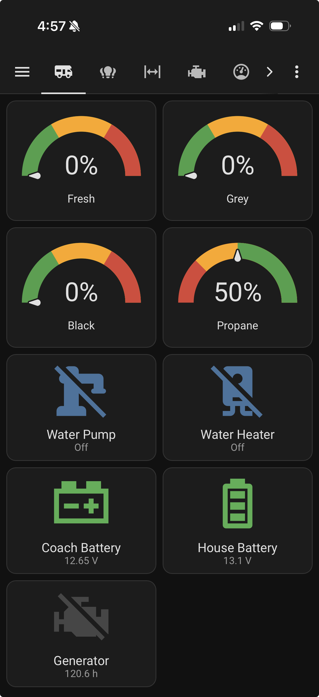
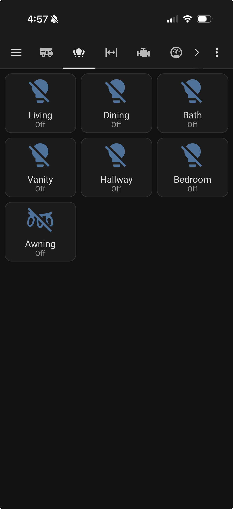
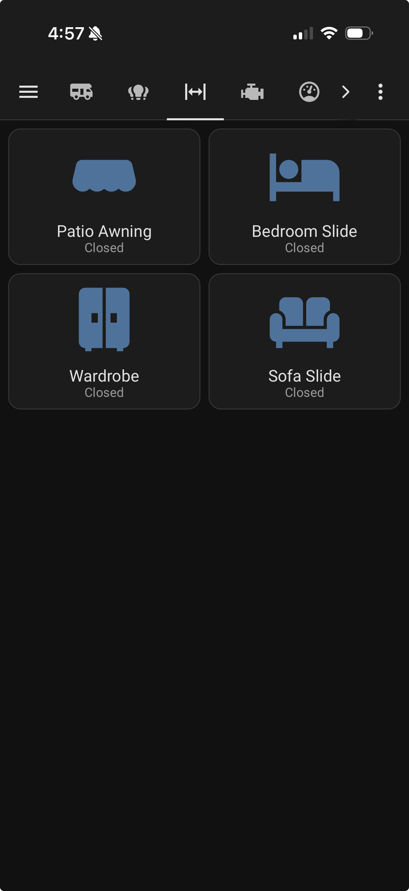
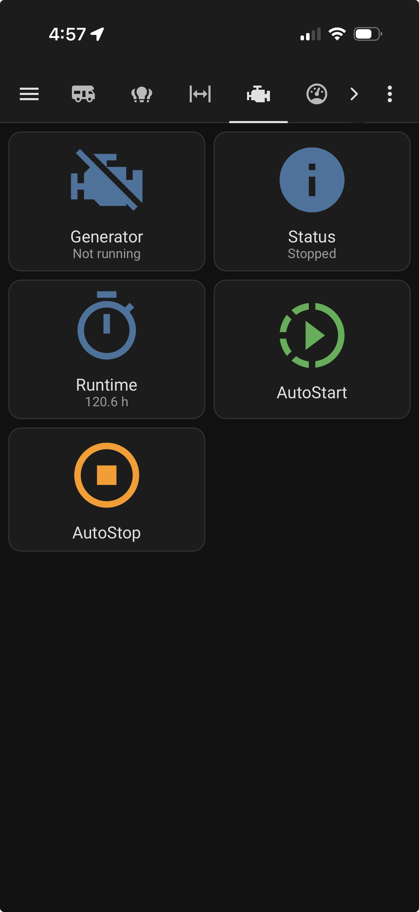
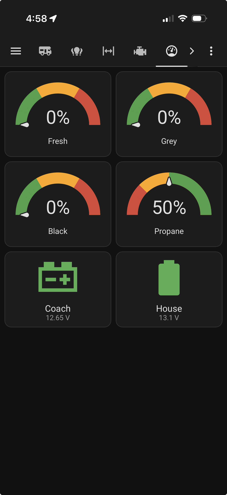
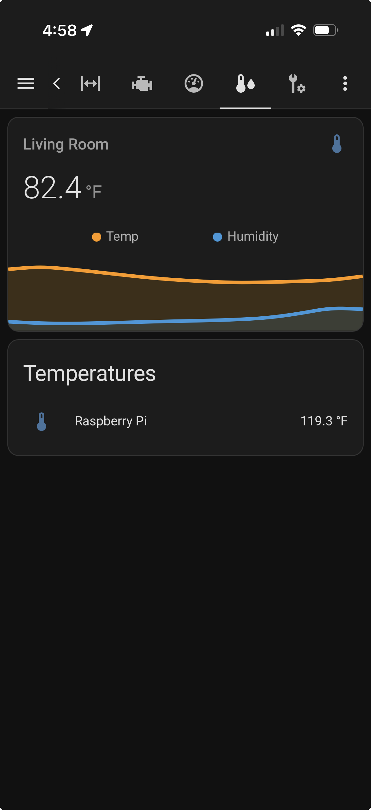
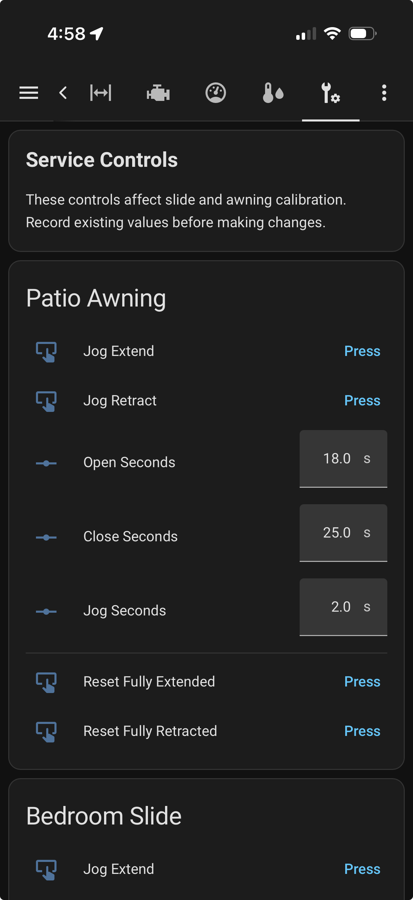

# Mobile Dashboard Example

This repository includes an optional mobile-friendly dashboard example for Home Assistant:

```text
dashboard/mooterhome_mobile.yaml
```

The dashboard is optimized for iPhone and Android use and demonstrates a real-world RV Home Assistant installation built around the Precision Plex integration.

## Screenshots

### Home



### Lights



### Slides



### Generator



### Resources



### Environment



### Service



## Dashboard Data Sources

The example dashboard combines data from multiple Home Assistant integrations. Not every entity shown in the screenshots is provided by the Precision Plex integration.

### Precision Plex Integration

Provided by this project:

- Fresh Water Tank
- Grey Tank
- Black Tank
- Propane Tank
- Water Pump
- Water Heater
- Generator Status
- Generator Runtime
- Generator AutoStart and AutoStop controls
- Patio Awning
- Bedroom Slide
- Wardrobe Slide
- Sofa Slide
- House Battery Voltage
- Precision Plex Awning Light

### Shelly Integration Examples

Some entities shown in the example dashboard are provided by Shelly devices and the Home Assistant Shelly integration, not by Precision Plex.

Examples in the author's installation include:

- Interior lighting circuits controlled by Shelly relays
- Coach/chassis battery voltage monitored by a Shelly UNI
- Living Room temperature and humidity from a Shelly environmental sensor

On the author's coach, several factory RV wall switches were replaced with momentary switches that toggle Shelly relays. Those Shelly relays are then exposed to Home Assistant through the Shelly integration.

### Other Home Assistant Entities

The example dashboard also includes a Raspberry Pi temperature sensor from Home Assistant's System Monitor integration.

## Customization Required

The dashboard YAML is intended as a starting point. Users should replace entity IDs with the entities available on their own coach and Home Assistant installation.
